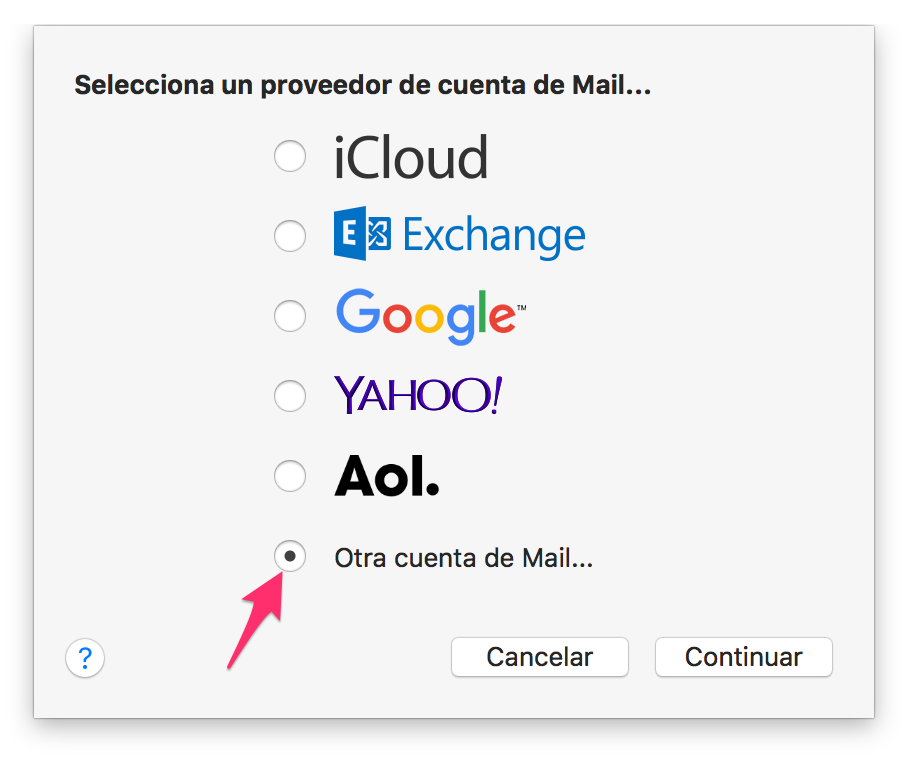
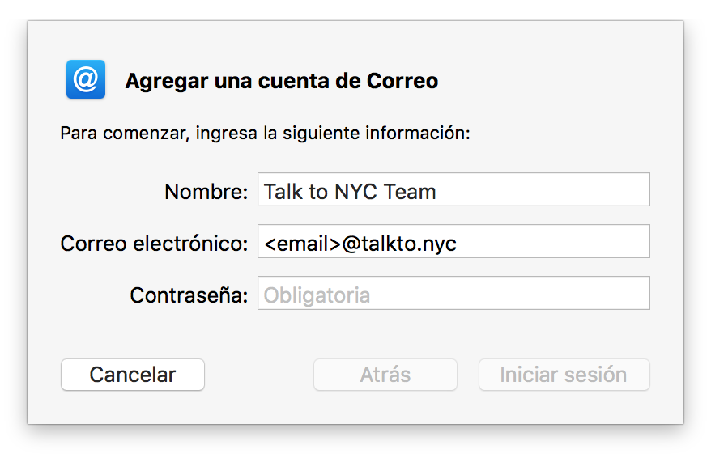
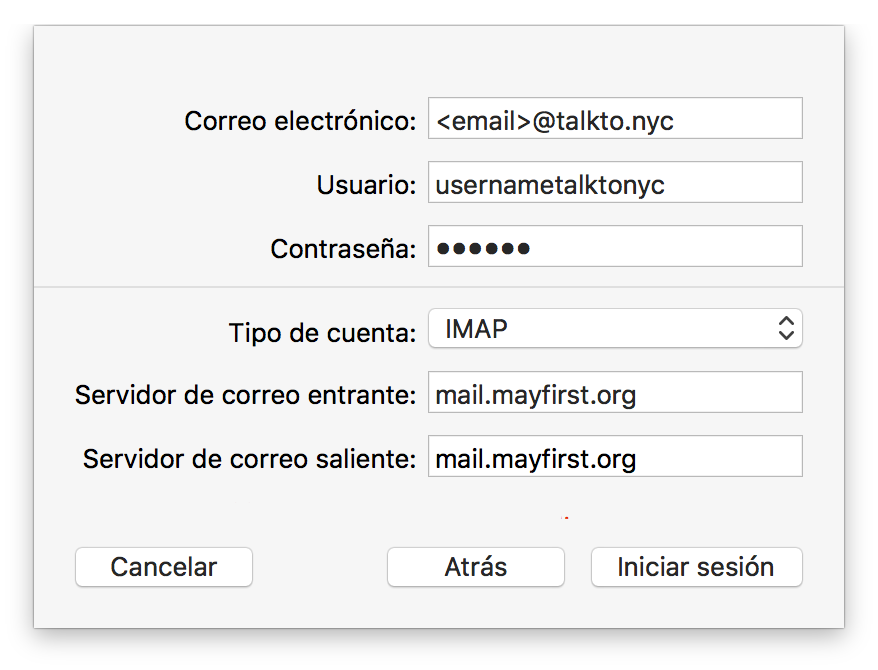
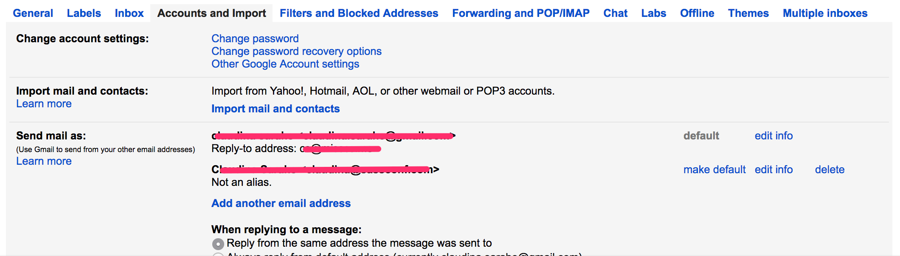
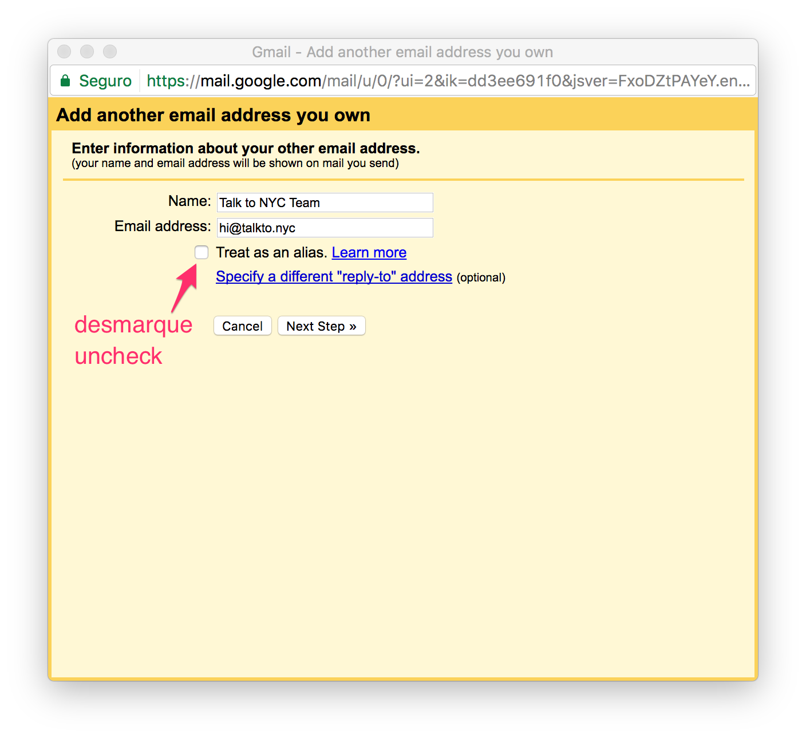
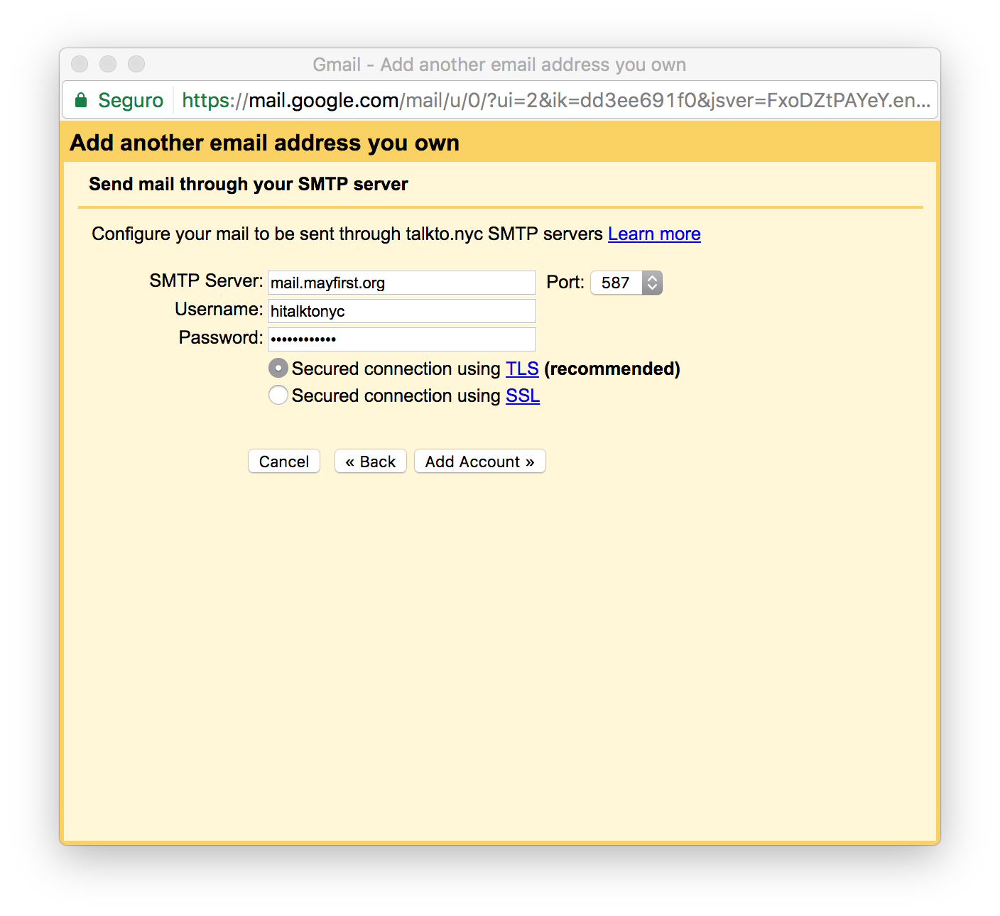

# Setup you Email Account

Talk to NYC uses [May First/People Link](https://mayfirst.org/en/index.html) for email. MFPL provides a webmail interface, but it recommend that you setup your `@talkto.nyc` account via IMAP though your preferred client (ex. Gmail, MacMail). 

If you have any problems with your email, please [open an issue](). 

**Steps**

1. [Reset your account password]().
2. [Configure your email client(s)]().
3. [Add signature]().
4. [Send off an email to ensure everything's copacetic]().

**Additional Resources**

* [Using Webmail]()
* [MFPL Email Server Configuration](https://support.mayfirst.org/wiki/faq/email/configure-email)

## Reset your password 🙈.

1. Navigate to [MFPL control panel](https://members.mayfirst.org/cp/_. Login with the provided username and password.
2. Enter a new password. 

## Configure your Email Client

We recommend using an email client, such as MacMail, Airplane, Thunderbird. The instructions for MacMail will work on all iOS devices. 

### Setup MacMail

1. Open MacMail and navigate to preferences. 
2. Navigate to Account Tab. Add a new account. Select _Other_ for provider. 
3. Add your email address 
4. Configure email servers 

### Setup Gmail

If you want to received mail through Gmail, the recommend approach is to contact `hi[at]talkto.nyc` and request email forwarding. [Here’s more information]() on why we recommend this approach.

Before proceeding, follow the steps [login to webmail](). You will need to verify your email account.

#### Configure your account to send mail as your project email account

1. Login to your gmail and navigate to your settings pages. 
2. Navigate to Account and Import Tab 
3. Enter your name as you want it to appear. Enter your email address. Uncheck _Treat as Alias_ 
4. Configure your email servers. Use the username provided along with yoru email address. Your password is the same one your changed earlier. 
 
5. Login to Roundcube to confirm your email account. 
 

### Setup Android phone

_Add directions_

## Adding a signature

_Add basic signature template_

## Using Webmail

1. Navigate to https://roundcube.mayfirst.org/
2. Enter your username and password
3. 🙌🏾📬
